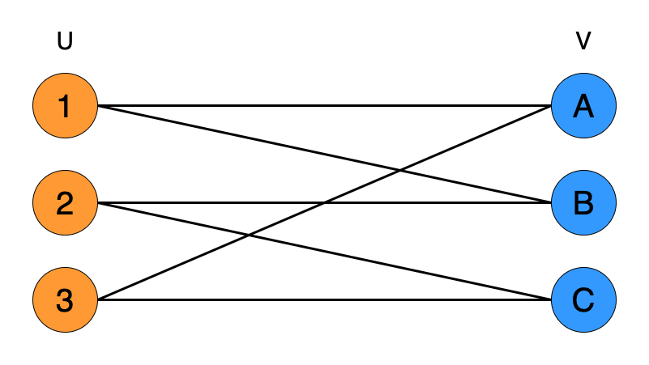
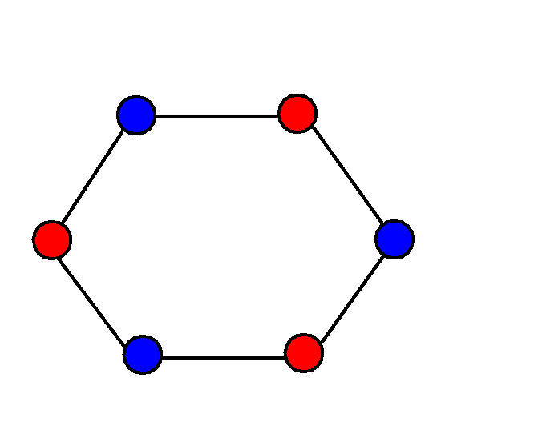
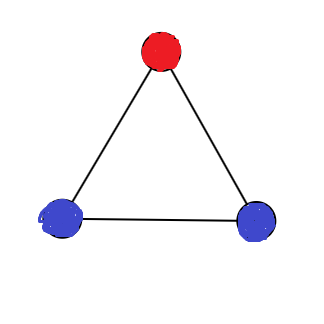

# Bipartite Graph 
- A Bipartite Graph is a graph whose vertices can be divided into two independent sets such that no node is connected to a node in the same set
- 
- **we can check if a graph is Bipartite or not by coloring the nodes such that the color of the neighbours of any node are different from it**
- 
- **if we find a neighbour of the same color so the graph is not Bipartite see image downbelow**
- 

